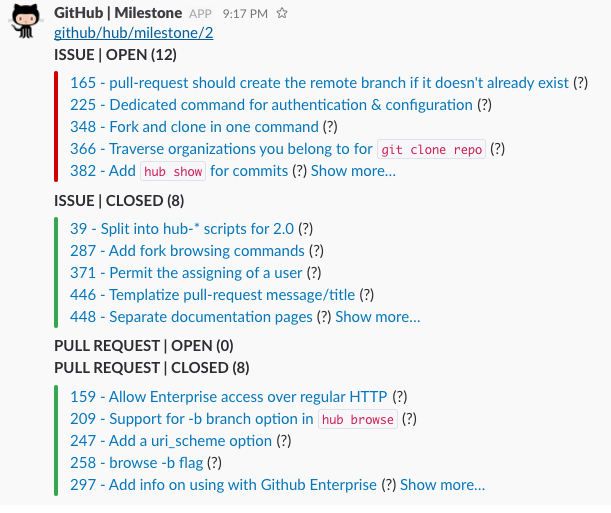

# beacon
beacon — Notify GitHub Milestone to Slack incoming webhook.

# Usage

```
$ beacon -o owner -r repo -m miletone_id
```

```
-c string
  	/path/to/config.json. (default: $HOME/.config/beacon/config.json)
-m string
  	milestone number
-o string
  	owner (e.g. github)
-r string
  	repo (e.g. hub)
-v	Print version.
```

# Example

```
$ beacon -o github -r hub -m 2
```


